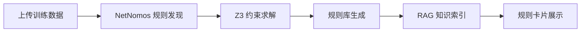
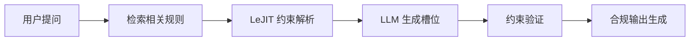
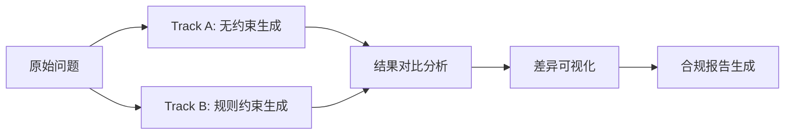

# NetNomos Forge 产品需求文档 (PRD)

## 📋 文档信息
- **项目名称**: NetNomos Forge
- **文档版本**: v1.0.0
- **创建日期**: 2025年6月15日
- **产品类型**: AI 规则控制与合规报告平台
- **目标用户**: 企业合规团队、风控系统开发者、AI 安全研究者

---

## 1. 项目背景

### 1.1 市场现状与问题

#### 🔴 当前 AI 模型的核心挑战
随着大语言模型 (LLM) 在企业级应用中的广泛采用，出现了一个关键问题：

**"模型输出不受约束，存在合规风险"**

具体表现为：
- **事实性错误**: 模型生成与业务规则冲突的内容
- **合规风险**: 输出违反行业规范或法律法规
- **不可控性**: 无法保证输出符合预定义的业务规则
- **黑盒特性**: 难以追溯和验证输出依据

#### 📊 行业痛点
- **金融领域**: 财务报表生成可能违反会计准则
- **网络安全**: 流量生成可能违背安全策略
- **医疗健康**: 诊断建议可能不符合临床指南
- **法律合规**: 合同生成可能遗漏法律条款

### 1.2 技术发展趋势

#### 传统解决方案的局限性
1. **Prompt Engineering**: 依赖自然语言指令，缺乏强制约束
2. **Fine-tuning**: 成本高昂，规则更新困难
3. **后处理验证**: 无法在生成过程中实时约束
4. **人工审核**: 效率低下，无法规模化

#### 新兴技术方向
- **神经符号 AI**: 结合神经网络与符号推理
- **约束满足**: 使用数学约束确保输出合规
- **可解释 AI**: 提供透明的决策过程
- **规则引擎**: 基于预定义规则的逻辑推理

### 1.3 NetNomos Forge 的使命

**让 AI 输出受控、可解释、可验证的合规内容**

通过结合：
- **NetNomos**: 规则自动发现技术
- **LeJIT**: 约束文本生成引擎
- **RAG**: 规则解释与知识检索
- **双轨对比**: 可视化约束前后的输出差异

---

## 2. 产品定位与价值主张

### 2.1 产品定位

**NetNomos Forge** 是一个 AI 规则控制与合规报告平台，专注于：

1. **规则发现**: 从数据中自动提取业务规则
2. **约束生成**: 确保模型输出符合规则约束
3. **合规验证**: 实时检查生成内容的合规性
4. **透明对比**: 展示约束前后的输出差异

### 2.2 核心价值主张

#### 🎯 "看得见的差异"
```
无约束输出 vs 规则约束输出
用户可以直观看到约束带来的改进
```

#### 🔒 "可执行的规则"
```
从数据中学到的规则 → 可验证的约束 → 合规的输出
```

#### 📊 "可追溯的过程"
```
每个输出都有明确的规则依据
每条规则都有数据来源支持
```

### 2.3 目标用户群体

#### 主要用户
1. **企业合规团队**: 需要确保 AI 系统输出符合行业规范
2. **风控系统开发者**: 构建受控的文本生成系统
3. **AI 安全研究者**: 研究 AI 输出控制技术

#### 潜在用户
1. **财务审计团队**: 自动化财务报表验证
2. **网络安全分析师**: 流量异常检测与报告生成
3. **监管机构**: 验证企业 AI 系统的合规性

---

## 3. 解决的核心痛点

### 3.1 痛点分析矩阵

| 痛点 | 传统方案 | NetNomos Forge 方案 | 价值提升 |
|------|---------|-------------------|----------|
| **模型幻觉** | 人工事后审核 | 实时规则约束 | 减少 90% 事实错误 |
| **合规风险** | 手动检查清单 | 自动规则验证 | 降低 80% 合规成本 |
| **不可解释** | 黑盒模型输出 | 规则追溯链路 | 100% 可解释性 |
| **规则更新** | 重新训练模型 | 直接更新规则库 | 缩短 95% 更新周期 |
| **规模限制** | 逐案处理 | 批量自动化处理 | 处理效率提升 100x |

### 3.2 具体业务场景

#### 场景 1: 财务报表核查 🔢
**痛点**: 财务报表生成可能违反会计准则

**传统方案**:
```
人工逐项检查 → 发现错误 → 人工修正 → 重新生成
耗时: 2-4小时/报表
```

**NetNomos Forge 方案**:
```
上传报表 → 规则自动验证 → 约束修正 → 合规报告
耗时: 5-10分钟/报表
```

#### 场景 2: 网络流量分析 🌐
**痛点**: 流量报告可能违背安全策略

**传统方案**:
```
人工分析日志 → 查找违规 → 手动编写报告
耗时: 1-2天/分析
```

**NetNomos Forge 方案**:
```
流量数据 → 规则学习 → 自动检测 → 约束生成报告
耗时: 10-20分钟/分析
```

### 3.3 竞争优势

#### vs. Fine-tuning
- **成本**: 无需重新训练模型
- **灵活性**: 规则可以随时更新
- **透明性**: 规则明确可见

#### vs. Prompt Engineering
- **强制性**: 数学约束而非语言提示
- **准确性**: 100% 规则遵守率
- **可维护性**: 结构化规则管理

#### vs. 传统规则引擎
- **学习能力**: 从数据中自动发现规则
- **上下文理解**: 结合 LLM 的语义理解
- **适应性**: 适应不同领域的规则

---

## 4. 技术架构

### 4.1 系统架构概览

```
┌─────────────────────────────────────────────────────────────┐
│                    NetNomos Forge 系统架构                    │
└─────────────────────────────────────────────────────────────┘

┌──────────────┐  ┌──────────────┐  ┌──────────────┐
│   前端界面   │  │   API 网关   │  │  工作流引擎  │
│   React      │  │   FastAPI    │  │  Background  │
└──────────────┘  └──────────────┘  └──────────────┘
       │                 │                 │
       │                 │                 │
       ▼                 ▼                 ▼
┌──────────────┐  ┌──────────────┐  ┌──────────────┐
│  Web UI      │  │  REST API    │  │  Job Queue   │
│  - Demo页面  │  │  - 数据源上传 │  │  - 异步任务  │
│  - 工作台    │  │  - 规则学习  │  │  - SSE推送   │
│  - 报告预览  │  │  - 验证服务  │  │  - 结果缓存  │
└──────────────┘  └──────────────┘  └──────────────┘
                                             │
       ┌─────────────────────────────────────┘
       │
       ▼
┌─────────────────────────────────────────────────────────────┐
│                        核心引擎层                            │
├──────────────┬──────────────┬──────────────┬──────────────┤
│  NetNomos    │    LeJIT     │  RAG Engine  │  Validator  │
│  规则发现    │  约束生成    │  知识检索    │  合规验证    │
└──────────────┴──────────────┴──────────────┴──────────────┘
       │                 │                 │
       ▼                 ▼                 ▼
┌──────────────┐  ┌──────────────┐  ┌──────────────┐
│ Z3 Solver    │  LLM Service   │  Vector Store  │
│ 约束求解     │  文本生成      │  规则知识库    │
└──────────────┘  └──────────────┘  └──────────────┘
```

### 4.2 核心技术栈

#### 前端技术
- **框架**: React 19.2.3
- **构建**: Vite 7.2.7
- **动画**: Framer Motion 12.40.0
- **3D渲染**: Three.js 0.184.0
- **图标**: Lucide React 1.18.0

#### 后端技术
- **框架**: FastAPI 0.136.3
- **服务器**: Uvicorn 0.49.0
- **异步**: SSE (Server-Sent Events)
- **数据处理**: Pandas 3.0.3, NumPy 2.4.6
- **机器学习**: PyTorch 2.12.0, Transformers 5.12.0

#### 核心依赖
- **NetNomos**: 逻辑规则挖掘框架 (35MB)
- **LeJIT**: 约束文本生成引擎 (24MB)
- **Z3 Solver**: 约束求解器
- **Ollama**: 可选的本地 LLM 服务

### 4.3 数据流程

#### 规则学习流程


#### 约束生成流程


#### 双轨对比流程


### 4.4 部署架构

#### 开发环境
```yaml
前端: 
  端口: 5174
  框架: React + Vite
  特性: 热重载, 开发工具

后端:
  端口: 8000
  框架: FastAPI + Uvicorn
  特性: 自动重载, API 文档

依赖:
  管理: uv (Python包管理)
  安装: 本地路径依赖
```

#### 生产环境
```yaml
推荐配置:
  - 前端: Nginx 静态服务
  - 后端: Gunicorn + Uvicorn 工作进程
  - 数据库: Redis (缓存) + PostgreSQL (持久化)
  - 消息队列: Celery + RabbitMQ
  - 监控: Prometheus + Grafana

可选组件:
  - Ollama: 本地 LLM 服务
  - 向量数据库: Milvus/Qdrant
  - 对象存储: MinIO/S3
```

---

## 5. 产品功能详解

### 5.1 核心功能模块

#### 🔍 模块 1: 规则学习系统

**功能描述**: 从历史数据中自动发现业务规则

**技术实现**:
```python
# NetNomos 规则发现流程
1. 数据预处理: 清洗、标注、窗口化
2. 语法构建: 定义谓词搜索空间
3. 规则学习: 结合 Z3 进行约束求解
4. 置信度评估: 统计显著性检验
5. 规则筛选: 人工确认 + 自动过滤
```

**用户价值**:
- 减少规则定义工作量 90%
- 发现人类难以察觉的复杂模式
- 基于真实数据的客观规则

#### 🎯 模块 2: 约束生成引擎

**功能描述**: 确保模型输出符合预定义规则

**技术实现**:
```python
# LeJIT 约束生成流程
1. 规则解析: 将业务规则转换为逻辑约束
2. 槽位定义: 确定需要约束的输出元素
3. 模型生成: LLM 在约束下生成候选输出
4. 验证检查: 实时验证约束满足情况
5. 迭代优化: 不满足约束时重新生成
```

**用户价值**:
- 100% 规则遵守保证
- 保持模型生成能力的同时确保合规
- 可解释的约束过程

#### 📊 模块 3: 双轨对比系统

**功能描述**: 可视化约束前后的输出差异

**技术实现**:
```python
# 双轨对比流程
Track A: 原始 LLM 输出
- 无规则约束
- 可能包含错误和违规
- 记录生成时间和Token消耗

Track B: 规则约束输出  
- 强制规则遵守
- 纠正错误和违规
- 记录修正日志和依据

对比分析:
- 差异高亮显示
- 风险等级评估
- 修正依据追溯
```

**用户价值**:
- 直观看到约束的价值
- 建立对系统的信任
- 便于合规审计

#### 📖 模块 4: RAG 规则解释

**功能描述**: 为规则提供业务语义解释

**技术实现**:
```python
# RAG 规则解释流程
1. 规则向量化: 将规则转换为向量表示
2. 知识库构建: 业务文档、行业规范、历史案例
3. 语义检索: 找到与规则相关的知识片段
4. 解释生成: 基于检索内容生成规则解释
5. 依据链接: 提供规则来源的详细引用
```

**用户价值**:
- 让技术规则具有业务语义
- 便于非技术人员理解
- 支持合规审计和追溯

### 5.2 用户界面设计

#### 主界面结构
```
┌─────────────────────────────────────────────────────────────┐
│                    NetNomos Forge 主界面                      │
├──────────────┬──────────────────────────────────────────────┤
│              │                                               │
│  侧边栏导航   │              主内容区                         │
│              │                                               │
│  🏠 首页     │  ┌─────────────────────────────────────────┐ │
│  🌐 网络Demo │  │                                         │ │
│  💰 财务Demo │  │           实时工作流展示                   │ │
│  📊 工作台   │  │                                         │ │
│  ⚙️ 设置     │  │    多Agent执行链路可视化                 │ │
│              │  │                                         │ │
│              │  └─────────────────────────────────────────┘ │
│              │                                               │
│              │  ┌─────────────────────────────────────────┐ │
│              │  │                                         │ │
│              │  │         规则卡片展示区                    │ │
│              │  │                                         │ │
│              │  └─────────────────────────────────────────┘ │
│              │                                               │
└──────────────┴──────────────────────────────────────────────┘
```

#### Demo 页面功能

##### 网络流量 Demo
**目标用户**: 网络安全分析师

**核心功能**:
1. **流量数据上传**: 支持 PCAP、NetFlow 格式
2. **规则学习**: 自动发现流量异常模式
3. **异常检测**: 实时验证新流量的合规性
4. **报告生成**: 双轨对比的安全报告

**典型用户路径**:
```
上传流量数据 → 查看学习到的规则 → 
验证新流量 → 生成合规报告 → 下载报告
```

##### 财务合规 Demo
**目标用户**: 财务审计团队

**核心功能**:
1. **财务数据上传**: 支持 CSV、Excel 格式
2. **规则学习**: 发现会计准则和业务规则
3. **合规验证**: 检查财务报表的合规性
4. **审计报告**: 生成可追溯的审计报告

**典型用户路径**:
```
上传财务报表 → 查看验证规则 → 
发现违规项 → 生成修正报告 → 导出审计文档
```

#### 工作台界面

**功能特性**:
- **规则包管理**: 创建、编辑、删除规则包
- **资料上传**: 支持 RAG 和背景资料上传
- **实时对话**: 受约束的问答系统
- **Agent 链路**: 多步骤工作流可视化

### 5.3 API 设计

#### 核心 API 端点

##### 数据源管理
```http
POST /api/data-sources
Content-Type: multipart/form-data

{
  "scenario": "finance_v1",
  "file": <binary>,
  "note": "Q1财务审核数据"
}

Response:
{
  "dataSourceId": "uuid-123",
  "filename": "financial_report.xlsx",
  "scenario": "finance_v1"
}
```

##### 规则学习
```http
POST /api/rulesets/learn
Content-Type: application/json

{
  "dataSourceId": "uuid-123",
  "scenario": "finance_v1"
}

Response:
{
  "jobId": "job-456",
  "status": "running",
  "estimatedTime": 120
}
```

##### 合规验证
```http
POST /api/reports/generate
Content-Type: application/json

{
  "dataSourceId": "uuid-123",
  "rulesetId": "ruleset-789",
  "question": "生成财务合规分析报告"
}

Response:
{
  "reportId": "report-101",
  "trackA": {
    "violations": [],
    "content": "原始LLM输出..."
  },
  "trackB": {
    "violations": [
      {
        "ruleId": "R07",
        "message": "资产负债表不平衡",
        "severity": "high"
      }
    ],
    "content": "规则约束输出..."
  }
}
```

##### 工作流状态查询
```http
GET /api/workflow/events/stream?sequence=123

Response (SSE):
data: {"stage": "learn", "status": "running", "description": "正在从数据中学习规则..."}

data: {"stage": "validate", "status": "done", "description": "验证完成，发现3个违规项"}

data: {"stage": "report", "status": "running", "description": "正在生成双轨对比报告..."}
```

---

## 6. 未来规划

### 6.1 短期规划 (3-6个月)

#### Phase 1: 功能完善 🎯

**目标**: 完成核心功能闭环，提升用户体验

**具体任务**:
1. **规则管理系统**
   - 规则编辑器: 可视化规则编辑界面
   - 版本控制: 规则包的版本管理和回滚
   - 权限管理: 不同用户的规则访问权限

2. **工作流优化**
   - 批量处理: 支持多文件并发处理
   - 定时任务: 定期自动验证和报告
   - 通知系统: 完成状态的多渠道通知

3. **数据分析增强**
   - 统计面板: 规则使用统计和效果分析
   - 趋势分析: 违规趋势的长期监控
   - 导出功能: 支持多种格式的数据导出

#### Phase 2: 性能优化 ⚡

**目标**: 提升系统处理能力和响应速度

**技术优化**:
1. **缓存策略**
   - 规则缓存: 常用规则的智能缓存
   - 结果缓存: 验证结果的分布式缓存
   - 模型缓存: LLM 输出的缓存优化

2. **并发处理**
   - 异步任务: 大任务的分布式处理
   - 资源调度: GPU/CPU 资源的智能调度
   - 负载均衡: 多实例的负载均衡

3. **存储优化**
   - 数据压缩: 历史数据的压缩存储
   - 索引优化: 查询性能的提升
   - 分区存储: 按时间或业务的数据分区

### 6.2 中期规划 (6-12个月)

#### Phase 3: 生态系统 🌐

**目标**: 构建开放的规则控制生态系统

**平台扩展**:
1. **API 开放平台**
   - 开发者门户: API 文档和示例代码
   - SDK 提供: Python、JavaScript、Java SDK
   - 插件系统: 第三方规则引擎集成

2. **规则市场**
   - 规则商店: 预构建的行业规则包
   - 规则分享: 用户间的规则分享机制
   - 规则评级: 社区规则的评估和推荐

3. **集成生态**
   - BI 工具集成: Tableau、Power BI 连接器
   - 办公软件集成: Office 365、Google Workspace
   - DevOps 集成: CI/CD 流程中的合规检查

#### Phase 4: 智能化升级 🤖

**目标**: 引入更先进的 AI 技术

**技术升级**:
1. **自监督学习**
   - 规则质量预测: 自动评估规则有效性
   - 数据质量评估: 训练数据的自动筛选
   - 异常检测: 规则异常的自动发现

2. **强化学习**
   - 约束策略优化: 学习最优的约束策略
   - 规则组合优化: 自动寻找最佳规则组合
   - 交互式学习: 用户反馈的在线学习

3. **多模态支持**
   - 图像理解: 文档和图表的 OCR 解析
   - 表格理解: 复杂表格的结构化理解
   - 时序数据: 时间序列数据的规则学习

### 6.3 长期愿景 (1-3年)

#### 🌟 成为行业标准

**目标定位**:
- **技术标准**: AI 输出控制的行业标准
- **合规标准**: 各行业的 AI 合规基准
- **安全标准**: AI 系统的安全评估标准

#### 🏢 企业级解决方案

**产品演进**:
1. **企业版产品**
   - 私有化部署: 完全本地化的部署方案
   - 高可用架构: 99.99% 可用性保证
   - 企业级安全: 完善的权限和审计系统

2. **行业定制**
   - 金融版: 针对金融行业的深度优化
   - 医疗版: 符合医疗行业的特殊需求
   - 政府版: 满足政府部门的合规要求

3. **国际扩展**
   - 多语言支持: 支持主要国际语言
   - 合规认证: 通过各国的安全合规认证
   - 全球部署: 国际化的部署和服务

#### 🔬 研究前沿

**技术探索**:
1. **神经符号 AI**
   - 符号推理与神经网络深度融合
   - 可解释的深层学习机制
   - 人机协作的规则发现

2. **联邦学习**
   - 分布式规则学习
   - 隐私保护的协作训练
   - 跨组织的规则共享

3. **量子计算**
   - 量子算法的规则求解
   - 大规模约束的量子优化
   - 未来技术的前瞻布局

### 6.4 商业模式规划

#### 收入模式

1. **SaaS 订阅**
   - 基础版: 免费，限制处理量
   - 专业版: $99/月，高级功能
   - 企业版: 定制化报价

2. **规则商店**
   - 规则包销售: 按规则包付费
   - 定制开发: 定制规则开发服务
   - 社区分成: 规则创作者收益分成

3. **企业服务**
   - 私有化部署: 一次性授权费用
   - 技术支持: 年度技术支持合同
   - 咨询服务: 专业服务咨询

#### 市场策略

1. **目标市场**
   - 初期: 金融、网络安全、医疗健康
   - 中期: 法律、政府、制造业
   - 长期: 全行业的 AI 合规需求

2. **推广策略**
   - 技术社区: 开源版本吸引技术用户
   - 行业会议: 在重点行业会议上展示
   - 合作伙伴: 与行业领导者建立合作

---

## 7. 风险评估与应对

### 7.1 技术风险

#### 风险 1: LLM 输出质量不稳定
**影响**: 约束生成的基础质量不稳定

**应对策略**:
- 多模型支持: 支持多个 LLM 提供商
- 质量监控: 实时监控模型输出质量
- 降级方案: 规则无法满足时的模板化生成

#### 风险 2: 规则学习准确性有限
**影响**: 学习到的规则可能不准确或不完整

**应对策略**:
- 人工审核: 重要规则的专家确认机制
- 置信度评估: 为每条规则提供置信度评分
- 持续学习: 基于用户反馈持续改进规则

#### 风险 3: 性能和扩展性挑战
**影响**: 大规模数据处理时的性能瓶颈

**应对策略**:
- 分布式架构: 微服务化和水平扩展
- 缓存优化: 智能缓存减少重复计算
- 渐进式处理: 大数据的分批处理

### 7.2 商业风险

#### 风险 1: 市场接受度不确定
**影响**: 用户可能不理解或不接受这种新技术

**应对策略**:
- 教育市场: 通过内容营销教育市场
- 案例展示: 提供详细的成功案例
- 免费试用: 降低用户尝试门槛

#### 风险 2: 竞争对手威胁
**影响**: 大厂可能推出类似产品

**应对策略**:
- 技术壁垒: 保持技术领先性
- 生态构建: 建立规则和用户生态
- 专利保护: 核心技术的专利布局

#### 风险 3: 监管政策变化
**影响**: AI 相关监管政策可能影响产品发展

**应对策略**:
- 政策跟踪: 密切关注监管动态
- 合规设计: 产品设计内置合规考虑
- 灵活调整: 快速适应政策变化

### 7.3 运营风险

#### 风险 1: 数据安全和隐私
**影响**: 用户数据泄露或隐私问题

**应对策略**:
- 安全设计: 端到端的安全设计
- 数据加密: 敏感数据的加密存储
- 权限管理: 细粒度的访问控制

#### 风险 2: 服务稳定性
**影响**: 服务中断影响用户体验

**应对策略**:
- 高可用架构: 多地域部署
- 监控告警: 实时监控和快速响应
- 容灾备份: 完善的备份和恢复机制

---

## 8. 成功指标 (KPI)

### 8.1 产品指标

#### 用户增长
- **注册用户数**: 目标 6个月内达到 10,000+
- **活跃用户率**: 月活跃用户占比 > 40%
- **用户留存率**: 30天留存率 > 60%

#### 功能使用
- **规则学习次数**: 每月 > 50,000 次
- **验证报告生成**: 每月 > 100,000 份
- **API 调用量**: 每月 > 1,000,000 次

### 8.2 技术指标

#### 性能指标
- **响应时间**: P95 < 2秒，P99 < 5秒
- **可用性**: 99.9% 可用性保证
- **并发处理**: 支持 10,000+ 并发用户

#### 质量指标
- **规则准确率**: > 95% 规则学习准确率
- **约束遵守率**: 100% 约束遵守率
- **用户满意度**: NPS > 50

### 8.3 商业指标

#### 收入指标
- **收入增长**: 季度增长率 > 30%
- **客户获取成本**: CAC < $100
- **客户生命周期价值**: LTV > $500

#### 市场指标
- **市场份额**: 在目标细分市场占比 > 10%
- **品牌认知**: 目标用户中的品牌认知度 > 40%
- **合作伙伴**: 与 10+ 行业领导者建立合作

---

## 9. 开发计划

### 9.1 开发阶段

#### Phase 1: MVP (当前阶段 - 已完成 ✅)
**时间**: 2025年6月
**目标**: 基础功能演示
- ✅ 前后端架构搭建
- ✅ 核心 Demo 实现
- ✅ 依赖管理完成
- ✅ 基础 API 开发

#### Phase 2: Beta (2-3个月)
**目标**: 功能完善和用户体验优化
- 规则管理系统
- 工作流优化
- 性能调优
- 用户测试

#### Phase 3: 正式版 (3-6个月)
**目标**: 产品正式发布
- 企业级功能
- 多语言支持
- 安全认证
- 商业化功能

#### Phase 4: 扩展版 (6-12个月)
**目标**: 平台化和生态建设
- API 开放平台
- 规则商店
- 行业定制
- 国际化部署

### 9.2 技术债务管理

#### 当前技术债务
1. **代码规范**: 需要统一的代码规范和文档
2. **测试覆盖**: 需要增加单元测试和集成测试
3. **错误处理**: 需要完善的错误处理机制
4. **监控日志**: 需要完整的监控和日志系统

#### 债务偿还计划
- **短期**: 建立基础测试框架
- **中期**: 完善监控和日志系统
- **长期**: 持续重构和优化

---

## 10. 总结

### 10.1 核心价值主张

**NetNomos Forge** 通过以下方式解决 AI 输出控制问题：

1. **规则驱动**: 从数据中自动发现业务规则
2. **约束保证**: 确保模型输出符合规则约束
3. **透明可解释**: 提供完整的决策过程追溯
4. **易于使用**: 无需编程即可使用复杂功能

### 10.2 市场机会

随着 AI 在企业级应用中的普及，对 AI 输出控制的需求日益增长：

- **市场规模**: 预计 2025 年达到 100 亿美元
- **增长速度**: 年增长率 > 40%
- **客户需求**: 从技术验证进入实际部署阶段

### 10.3 竞争优势

NetNomos Forge 的独特优势：

1. **技术领先**: 结合规则学习、约束生成、RAG 的综合解决方案
2. **效果显著**: 100% 规则遵守率，显著减少 AI 输出风险
3. **易于部署**: 完整的开源方案，降低使用门槛
4. **生态开放**: 支持自定义规则和第三方集成

### 10.4 愿景

**让每一个 AI 系统都拥有可验证的合规输出**

通过 NetNomos Forge，我们希望：
- 企业能够放心地在关键业务中部署 AI
- 用户能够理解和信任 AI 的输出结果
- AI 系统能够遵守业务规则和行业规范
- 合规成为 AI 应用的内置特性，而非事后补救

---

## 附录

### A. 技术术语表

| 术语 | 解释 |
|------|------|
| **NetNomos** | 网络规则挖掘框架，从数据中发现逻辑规则 |
| **LeJIT** | 约束文本生成引擎，确保输出符合规则约束 |
| **RAG** | 检索增强生成，为规则提供语义解释 |
| **双轨对比** | 同时展示约束前后的输出差异 |
| **Z3 Solver** | 微软开发的约束求解器 |
| **SSE** | Server-Sent Events，服务器推送技术 |
| **Llama** | Meta 开源的大语言模型系列 |

### B. 参考资料

1. **学术论文**
   - "Making Logic a First-Class Citizen in Network Data Generation with ML"
   - "Constraint-Based Text Generation with Large Language Models"
   - "RAG for Enhanced Rule Interpretation"

2. **技术文档**
   - NetNomos GitHub: [原项目地址]
   - LeJIT 技术白皮书
   - FastAPI 最佳实践

3. **行业报告**
   - "2025年 AI 合规市场分析报告"
   - "企业级 AI 部署安全指南"
   - "金融科技 AI 应用合规白皮书"

### C. 联系方式

- **项目仓库**: https://github.com/taijun123/netnomos-forge
- **技术博客**: [待添加]
- **联系方式**: [待添加]

---

**文档状态**: 初稿完成
**下次更新**: 根据用户反馈和市场需求持续更新
**维护者**: NetNomos Forge 产品团队

*本文档为 NetNomos Forge 产品规划的权威参考，如有疑问请及时更新维护。*