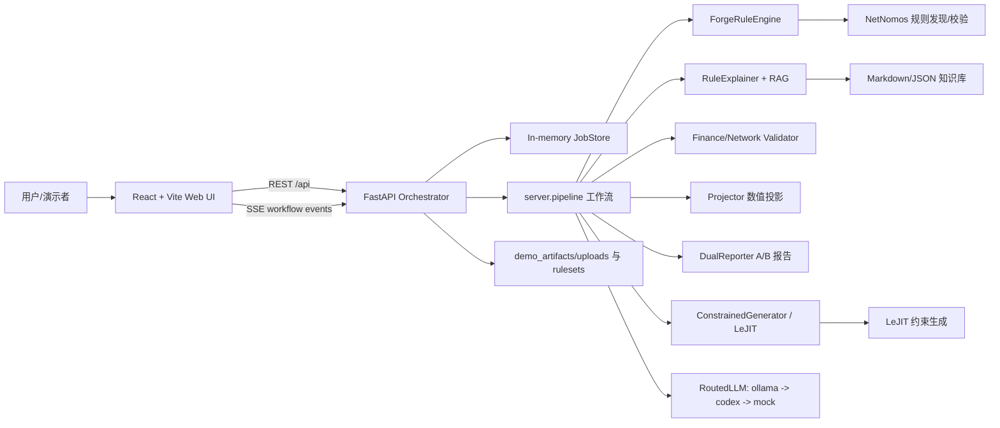

# NetNomos Forge 项目架构说明

本文说明 `netnomos-forge` 的整体架构，覆盖 Web 前端、FastAPI 后端、核心规则与生成技术，以及当前演示边界。

## 1. 项目定位

NetNomos Forge 是一个“模型外部规则控制层”的产品化演示项目。它不是改造基础模型本身，而是在模型调用链路外侧增加可审计、可解释、可复用的规则层：

1. 从干净数据中学习或加载规则。
2. 将规则解释成业务可读的规则卡。
3. 对新上传资料做规则校验。
4. 生成 A/B 双轨结果：
   - A 轨：裸模型或确定性 mock 输出，展示不受规则约束的风险。
   - B 轨：经过规则校验、数值投影、受控槽位回填后的合规输出。
5. 在 Web 端展示工作流进度、规则卡、违规明细、双轨报告和下载结果。

当前主场景包括：

- `finance_v1`：财务报表规则、错误注入、规则校验、数值修正和双轨报告。
- `network_cidds`：CIDDS/NetFlow 规则加载、规则卡解释、新资料核查和受约束样本生成。
- `office_demo`：办公室式工作流演示入口，整合财务与网络能力。

## 2. 总体架构



核心设计是“前端只消费统一 API，后端只暴露稳定契约，核心能力封装在 `forge` SDK”。这样 Web 页面、服务器编排和规则/生成算法可以相对独立演进。

## 3. 目录结构

```text
netnomos-forge/
  forge/                         核心 SDK 与场景逻辑
    contracts.py                 全项目数据结构和 API 路径契约
    core/                        engine / explainer / llm / generator / projector / reporter
    scenarios/                   场景 spec、知识库、生成器、校验器
    rulesets/                    golden 规则、学习产物、LeJIT bundle、合规样本
  server/                        FastAPI 应用、后台 job、SSE、内存 store
  web/                           React/Vite 产品演示前端
  NetNomos/                      仓库内 NetNomos 源码依赖
  LeJIT/                         仓库内 LeJIT 源码依赖
  demo_artifacts/                演示上传文件、生成文件、示例 prompts
  scripts/                       快速验证和宿主机辅助脚本
  tests/                         Python 测试
```

推荐检出结构：

```text
model_control/
  netnomos-forge/
    NetNomos/
    LeJIT/
    forge/
    server/
    web/
```

`netnomos-forge/pyproject.toml` 通过 `uv` 的 editable 本地依赖引用仓库内的 `NetNomos` 和 `LeJIT`，所以新同学只需要 clone 一个 `netnomos-forge` 仓库即可安装后端依赖。

## 4. Web 前端架构

前端位于 `web/`，技术栈为：

- React 19
- TypeScript
- Vite
- Three.js
- Framer Motion
- lucide-react

入口文件：

- `web/src/main.tsx`：挂载 React 应用。
- `web/src/App.tsx`：轻量 hash 路由，不使用 `react-router`。
- `web/src/lib/apiClient.ts`：统一封装 REST API 调用、上传、job 查询、workflow 启动。
- `web/src/lib/events.ts`：封装 EventSource/SSE 订阅，并在必要时轮询 job 状态。
- `web/src/types/api.ts`：前端侧 API 类型和路径常量。

主要页面：

```text
web/src/pages/
  IntroPage.tsx          产品介绍页
  NetworkDemoPage.tsx    网络流量 demo
  FinanceDemoPage.tsx    财务报表 demo
  OfficeDemoPage.tsx     办公室工作流 demo
  WorkspacePage.tsx      工作台式综合演示
  LogDemoPage.tsx        日志与 API 调试页
```

本地开发时 Vite 监听 `5173`，并在 `web/vite.config.ts` 中把 `/api` 代理到 `http://127.0.0.1:8000`。因此推荐让 `VITE_API_BASE` 保持空值，前端用同源 `/api`，由 Vite dev server 转发到后端。

## 5. 后端架构

后端位于 `server/`，技术栈为：

- FastAPI
- uvicorn
- SSE streaming
- 后台线程 job
- 内存态 `JobStore`

关键文件：

```text
server/app.py       FastAPI app factory、REST endpoint、SSE endpoint
server/pipeline.py  finance/network/office 工作流编排
server/store.py     内存 job、事件、规则卡、报告结果缓存
```

`server.app:create_app` 是应用工厂，FastAPI 依赖在函数内部懒加载，方便测试和沙箱环境 import。核心 API 包括：

| 方法 | 路径 | 作用 |
|---|---|---|
| `POST` | `/api/data-sources` | 上传或登记数据源，multipart 文件保存到 `demo_artifacts/uploads/<scenario>/` |
| `POST` | `/api/rulesets/upload` | 加载场景默认规则或指定规则文件 |
| `POST` | `/api/rulesets/learn` | 启动后台 workflow job |
| `GET` | `/api/rulesets/{ruleset_id}/cards` | 获取规则卡 |
| `POST` | `/api/reports/generate` | 同步生成双轨报告 |
| `GET` | `/api/workflow/events/stream` | 按 `job_id` 或 `sequence` 订阅 SSE |
| `GET` | `/api/jobs/{job_id}` | 查询 job 状态、历史事件和最终结果 |
| `POST` | `/api/chat/constrained` | 受约束聊天与数值白名单检查 |
| `GET` | `/api/health` | 健康检查 |

后端 job 的典型生命周期：

1. 前端调用 `/api/rulesets/learn`，传入 `scenario`、`sequence` 和可选的 `dataSourceId`、`question`、`reportPrompt`。
2. 后端创建内存 job，并启动后台线程。
3. `server.pipeline` 按阶段执行上传、准备、规则加载/学习、解释、校验、投影、报告和 diff。
4. 每个阶段写入 `WorkflowEvent`，前端通过 SSE 实时展示。
5. job 完成后，最终规则卡、违规报告、双轨报告和 office state 写回 `JobStore`。
6. 前端通过 `/api/jobs/{job_id}` 拉取最终结果并渲染。

注意：`JobStore` 是内存实现，后端重启后历史 job 会丢失。演示录屏时建议不要使用 `--reload`，避免 reload 进程导致状态不一致。

## 6. 核心 SDK 架构

核心能力位于 `forge/`。稳定契约集中在 `forge/contracts.py`：

- `Scenario`
- `Rule`
- `RuleSet`
- `Violation`
- `ViolationReport`
- `RuleCard`
- `TrackReport`
- `DualReport`
- `WorkflowEvent`
- REST API 路径常量

主要核心模块：

| 模块 | 职责 |
|---|---|
| `forge/core/engine.py` | `ForgeRuleEngine`，封装 NetNomos 规则学习、规则加载、规则校验、规则卡基础模板 |
| `forge/core/explainer.py` | `RuleExplainer`，从 Markdown/JSON 知识库检索 RAG context，并增强规则卡 |
| `forge/core/llm.py` | `RoutedLLM`，按角色路由到 Ollama、Codex 或 mock |
| `forge/core/generator.py` | `ConstrainedGenerator`，封装 LeJIT 训练、加载 bundle、受约束生成 |
| `forge/core/projector.py` | 根据违规报告对数据做数值投影和修正 |
| `forge/core/reporter.py` | 生成 A/B 双轨报告、数值槽位、diff HTML |
| `forge/core/injector.py` | 场景错误注入辅助 |

### 6.1 NetNomos

NetNomos 是规则发现与规则表达的核心来源。在网络场景中，项目可加载归档的 CIDDS golden 规则，也可以在宿主机环境通过 NetNomos 学习规则。Forge 侧把 NetNomos 的规则结构转成统一的 `RuleSet`。

### 6.2 LeJIT

LeJIT 负责受约束生成。网络场景中 B 轨优先使用 `forge/rulesets/network_cidds/lejit_bundle/` 中的 bundle 生成合规 NetFlow 样本；如果 bundle 或运行环境不可用，则使用归档合规样本作为稳定 demo 降级。

### 6.3 RAG 与规则解释

知识库文件位于：

```text
forge/core/knowledge/
forge/scenarios/<scenario>/knowledge/
```

支持 Markdown 和 JSON 两类资料。`RuleExplainer` 会按规则文本、字段、标签等检索相关片段，生成规则卡 citation。是否调用 LLM 润色由环境变量控制，默认关闭以保证 demo 稳定。

### 6.4 LLM 路由

LLM 是可选增强。默认降级顺序为：

```text
ollama -> codex -> mock
```

常见配置：

| 环境变量 | 说明 |
|---|---|
| `FORGE_RULECARD_LLM` | 设置为 `1/true/yes/on` 才启用规则卡 LLM 润色 |
| `FORGE_RULECARD_LLM_MAX_CARDS` | 每个 workflow 最多润色的规则卡数量 |
| `FORGE_RAG_TOP_K` | 每条规则检索的知识片段数量 |
| `FORGE_OLLAMA_HOST` / `OLLAMA_HOST` | Ollama 服务地址 |
| `FORGE_OLLAMA_EXPLAIN_MODEL` | 规则解释模型 |
| `FORGE_OLLAMA_DRAFT_MODEL` | 草稿生成模型 |

无 Ollama 时系统仍可通过 mock 跑通确定性演示。

## 7. 场景工作流

### 7.1 财务场景 `finance_v1`

主要文件：

```text
forge/scenarios/finance_v1/
  dataset_spec.json
  grammar_spec.json
  manual_rules.json
  faults.py
  generator.py
  validator.py
  report_template.md
  knowledge/
```

典型链路：

1. 构造干净财务数据。
2. 注入财务错误，形成待审资料包。
3. 加载或合并财务规则。
4. `FinanceValidator` 生成 `ViolationReport`。
5. `Projector` 修正可投影数值。
6. `DualReporter` 生成：
   - A 轨：可能照抄错误数字的报告。
   - B 轨：只使用合规槽位和修正值的报告。
7. 生成 diff HTML，供前端标红展示。

### 7.2 网络场景 `network_cidds`

主要文件：

```text
forge/scenarios/network_cidds/
  dataset_spec.json
  grammar_spec.json
  knowledge/

forge/rulesets/network_cidds/
  golden/
  lejit_bundle/
  sample_b.json  # 参考/回归样本；运行时 B 轨以 LeJIT 终检筛选结果为准
```

典型链路：

1. 加载 NetNomos 归档 golden 规则。
2. 生成规则卡和 RAG citation。
3. 上传待核查 NetFlow CSV。
4. 校验 UDP Flags、Packets/Bytes 物理上下界、DNS 端口身份等规则。
5. A 轨展示带错误样本。
6. B 轨通过 LeJIT bundle 或合规归档样本生成 0 违规结果。

### 7.3 办公室场景 `office_demo`

办公室场景是产品化入口，用更直观的团队工作流形式展示后端能力。它复用财务和网络 pipeline 产物，汇总为 office state，并支持 `/api/chat/constrained` 基于最近后端状态回答问题。

## 8. 数据与产物

演示资料：

```text
demo_artifacts/w4_demo_assets/
  user.md
  finance/
  network/
```

上传文件保存位置：

```text
demo_artifacts/uploads/<scenario>/
```

规则和生成相关产物：

```text
forge/rulesets/<scenario>/
```

测试和快速验证：

```text
scripts/quick_validate.py
tests/
```

## 9. 当前边界

当前版本以 W4 稳定演示为目标，需要明确以下边界：

- 上传文件会保存、登记 `dataSourceId`，并传入 workflow job。
- 当前财务/网络校验和 A/B 输出主要复用稳定场景管线，不是对任意 CSV/PDF/PCAP 做通用逐行解析。
- `JobStore` 是内存态，后端重启后 job 历史和最终产物会丢失。
- Ollama、真实 NetNomos learn、真实 LeJIT train 都是可选增强；缺失时系统会走稳定降级路径。
- `web/` 当前是演示型前端，不是多租户生产控制台。
